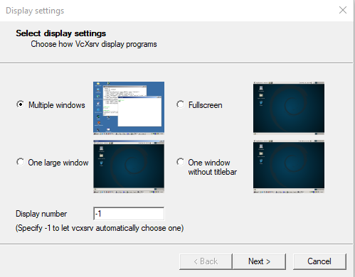
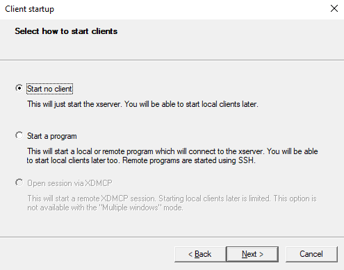
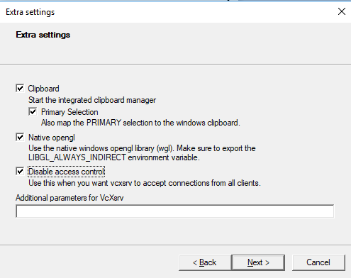

# Development Structure for a cross Platform Application

## Idea

The application in this repository answers a very simple question:
"Can I develop an application using my preferred environment
(ubuntu linux as an example), and then deploy it to windows using `docker`"

### Priorities

 - Guest system is linux, ubuntu I think

 - Develop an guest application using graphical resources of the host system
   both windows and linux, and maybe mac os.

## Linux

Simply copy what I did at camlin.

## Winzoz

Get inspiration from this [link](https://dev.to/darksmile92/run-gui-app-in-linux-docker-container-on-windows-host-4kde)

- Install the X server on windows (I don't like this very much bust still). Remember to save the configuration file.

- Install and configure the X server:

   - Download executable from [here](https://sourceforge.net/projects/vcxsrv/)
   - Install it and launch it.
   - Multiple Windows:

     

   - Start no client:

     

   - Disable Access Control:

     

   - Save configuration, at `%userprofile%` location:

     

   - Luach `Xlaunch` and make sure it is running:

     

- Install Docker Desktop

- Make sure winzoz has the correct login credentials:
```
docker logout
docker login
```
- Prepare a simple `Dockerfile`
```
FROM ubuntu:18.04
RUN apt-get update && apt-get install -y firefox
CMD /usr/bin/firefox
```
- Build the docker image;
```
docker build -t firefox .
```
- Configure the display variablex:
   - First Check your ETHERNET ADAPTER IP:
   ```
   ipconfig
   ```
   ```
   Ethernet adapter Ethernet 2:

      Connection-specific DNS Suffix  . : dl.net
      Link-local IPv6 Address . . . . . : fe80::79e1:6016:e51d:988%13
      IPv4 Address. . . . . . . . . . . : 10.139.40.138
      Subnet Mask . . . . . . . . . . . : 255.255.255.0
      Default Gateway . . . . . . . . . : 10.139.40.1
   ```
   - Set the `DISPLAY` variable
   ```
   set-variable -name DISPLAY -value 10.139.40.138
   ```
- Run the container:
```
docker run -ti --rm -e DISPLAY=$DISPLAY firefox
```
